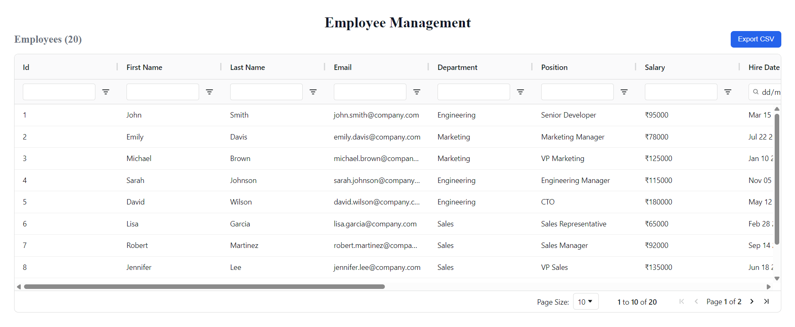
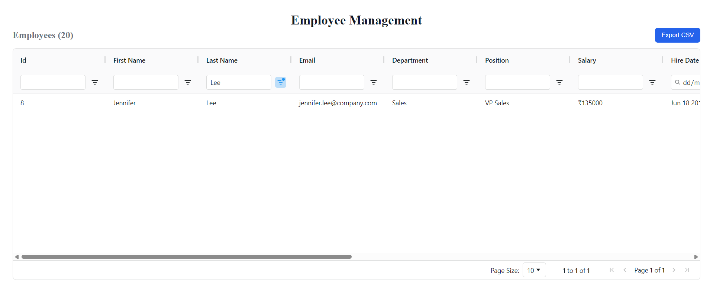
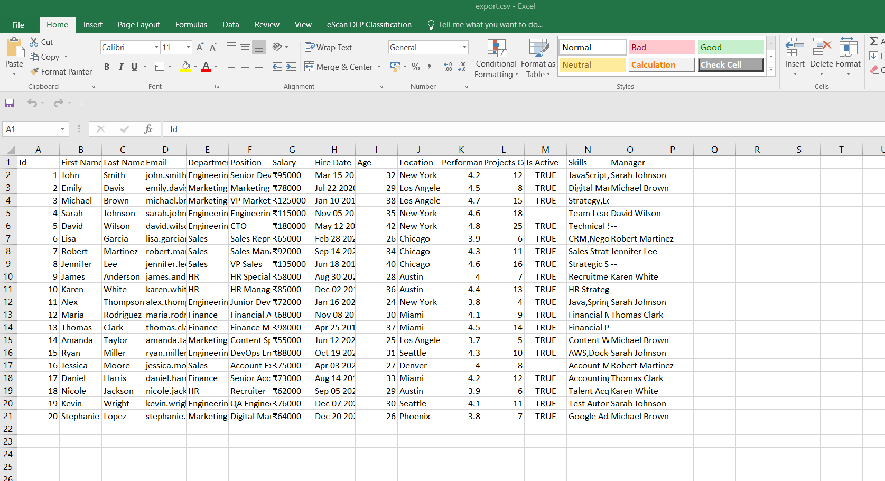

# frontend-dashboard-table

Employee Management Dashboard

A modern React dashboard built with AG Grid to efficiently display and manage employee data.
The application supports sorting, filtering, pagination, and CSV export while maintaining a clean and scalable structure.

Live Features

• Interactive data table using AG Grid
• Column sorting
• Column filtering
• Pagination
• CSV export
• Clean dashboard layout
• Handles large datasets efficiently

Tech Stack

React

AG Grid

JavaScript

CSS

Project Structure
src
│
├── components
│   └── GridTable.jsx        # AG Grid table component
│
├── pages
│   └── Dashboard.jsx        # Dashboard layout
│
├── data
│   └── data.json            # Employee dataset
│
├── css
│   └── dashboard.css        # Styling
│
├── App.jsx
└── index.js

Getting Started
1. Clone the repository
git clone https://github.com/shubhampalav2/frontend-dashboard-table.git

2. Navigate to the project
cd frontend-dashboard-table

3. Install dependencies
npm install

4. Run the project
npm start

AG Grid Functionalities Used

Client Side Row Model

Column Filters

Sorting

Pagination

Value Formatter

CSV Export

Implementation Highlights
Handling Array Data in Grid
valueFormatter:(params)=>Array.isArray(params.value) ? params.value.join(','):"--"}

Formatting Date
valueFormatter:(params)=>params.value ? new Date(params.value).toDateString().slice(4) : "--" }

ScreenShot

Filtered Data by LastName

Exported CSV

